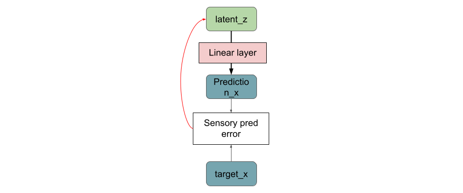

<!-- # Aligning images -->

<!-- ## `right` alignment


This is the code you need to align images to the right: -->

<!--  -->

<!-- # **UNDER CONSTRUCTION...** -->
**_Warning_:** If you suffer from epilepsy, photosensitive seizures, or related problems please do no watch Fig. 21 in Experiment 4. It has some flashing of light effects which can be difficult for you.
<div align='center'>
    <h1>Exploring the behavior of Predictive Coding Networks in the Neural Cellular Automata context.</h1>
</div>

## Introduction
Predictive Coding or PC views the brain as a hierarchical composition of layers. Each layer predicts the activity of the layer below. The core idea is that given sensory input, the brain tries to minimize the prediction error in each layer. When used in deep learning applications, PC networks have already shown comparable and even better performances in some cases. On the other hand, in Cellular Automata or CA, cells following simple rules produce complex results as collective behavior. In this project, one particular neural network-based cellular automata system is dissected. This neural cellular automata or NCA is used to construct a self-organizing system [[1]](#1). Compatible parts from the NCA are replaced by PC components and systems behavior is monitored to get a better understanding of how PC works. I attempt to explain and hypothesize various results found by adding the PC elements. The main similarities and dissimilarities between PC and NCA are:
- Local computation: both NCA and PC has local feature computation at their core operation.
- Adaptation: NCA adapts the biological shape by growing or filling. Changes in the brain are adapted in PC theory.
- NCA comes from the theory of learning local rules and PC comes from the neuroscience perspective. Although they are from different fields, they have similar goals, such as self-organization or self prediction.

## Predictive Coding or Predictive Processing
Predictive Coding is a theory that comes from the neuroscience field. In 1999, it was introduced as a means of visual processing [[12]](#12) in the brain. The core idea is, in the hierarchical visual processing system in the brain, a level predicts the activities of its immediate lower-level using top-down connections. Therefore, one of the major differences between a deep neural network and a Predictive Coding Network (PCN) is the feedback or top-down connections. In [[12]](#12), PCN was used for end-stopping. Karl Friston and others used PCN for diverse perceptual applications such as repetition-suppression [[13]](#13), bistable perception [[14]](#14) and attentional modulation of neural activity [[15]](#15), [[16]](#15).

A very basic PC level is shown in Fig 1 (left). Here, **B** is bottom-up or feed-forward connection in this level. Having only **B** is the same as a multilayer perceptron, shown in Fig 1 (right). **A** defines the top-down connection. r<sub>l</sub> is recurrently updated using **C**. The recurrent operation is shown in Fig 2. r<sub>l</sub><sup>n</sup> predicts r<sub>l-1</sub>, the prediction p<sub>l</sub><sup>n+1</sup> is subtracted from r<sub>l-1</sub> which gives error e<sub>l</sub><sup>n+1</sup> at time step n+1. Then r<sub>l</sub><sup>n+1</sup> is updated using the prediction error and the representation from previous step. In the lowest level of a PCN, r<sub>l-1</sub> would be the actual inputs. Usually PCNs operate on local features on the lowest level. Hence the actual input is a part the input such as a small patch of an image. Each level in a PCN is updated independent of other levels. Therefore, it can approximate backpropagation. Millidge et al [[17]](#17) showed that PCNs can perform decently as CNN, RNN and LSTM networks when used for instead of backpropagation.


 <br>
<div align='center'> 
<!--     
     <br> -->
    Fig 1: (left) One level of a PCN. Here, r<sub>l-1</sub> is the output of layer l-1 and r<sub>l</sub> is the output of layer l. A, B and C are the weight Matrics. (right) One layer in a plain Neural network. 
</div>
<br>


<br>
<div align='center'> 
<!--      <br> -->
    Fig 2: Recurrance in one PCN level.
</div>

## Neural Cellular Automata
#### CAs an NCAs
Cellular Automata (Cellular Automaton or CA) consists of regular grid cells with infinite dimensions and a finite number of states for each grid. In a typical CA, each state has an initial state. States are updated based on a fixed set of rules (e.g. mathematical equation [[2]](#2)) and the states of neighboring cells. The states of all cells can be updated simultaneously [[3]](#3) or in a stochastic fashion. Each cell follows the same set of simple rules and produces complex results. CA was first introduced as a self-replication model [[4]](#4). A popular example of CA is the _Game of Life_ [[5]](#5). There are more generalized versions of the _Game of Life_, that work more on the continuous domain [[6]](#6), [[7]](#7), [[8]](#8). One application of using CA is to find predefined patterns using fixed rules for cells. For similar purposes evolutionary algorithms are used in [[9]](#9), [[10]](#10), [[11]](#11). Neural Networks are also integrated into CAs. The CA model that is used in this project is a neural network based [[1]](#1). This model is used to create self-organizing systems. Neural GPU [[18]](#18), [[19]](#19) is another neural network-based CA model. It was used for learning multiplication and sorting.


<br>
<div align='center'> 
<!--      <br> -->
    Fig 3: Example of Cellular Automata (Conways Game of Life). GIF taken from [WiKi](https://en.wikipedia.org/wiki/File:Conways_game_of_life_breeder_animation.gif)
</div>

#### Self Organisation

<!--  -->

One of the most fundamental skills a living being develops is organizing its body shape, most of the time from a single cell.
Self-organizing systems grow, maintain, and repair themselves. Individual cells form a robust system by communicating with their immediate neighbors and following the same set of simple rules. The study of self-organizing systems is particularly interesting for their plasticity and robust nature. It will help us build systems that can grow when necessary and also recover themselves following damages. An example of self-organization is shown in Fig 4. A planarian or flatworm can grow any part of the body. It is fascinating that it can even generate the brain and still have the memories of the previous brain [[21]](#21).


<br>
<div align='center'> 
<!--      <br> -->
    Fig 4: Example of self organisation [[1]](#1). A flatworm growing its missing parts.
</div>

<!-- ## Understanding the PC layer
- Basic idea: two ways to update a level. updating weights, updating representations
- simple linera operation, how error signals are used: visual example (-1-5)=5-6 (1-5)=5-4
-  -->

## Replacing parts of NCA with PC elements
In this section, I will explain the NCA model and show how PCN components can be integrated. The NCA network is generally a recurrent residual convolutional network. The input to the NCA model is a part of an organism. The part can be as small as a single point. The model takes the input and reconstructs the desired shape in an arbitrary number of CA steps, **N**. A single CA step is shown in Fig 5. The input shape is (8, 72, 72, 16). Here, 8 is the batch size, 72x72 is the dimension of each image. The number of channels is 16, where the first four channels are RGBA (A is the alpha channel) channels and the rest of the 12 hidden channels are supposed to capture the hidden rules necessary for CA. The alpha channel decides if a cell is active or inactive based on the cell's immediate neighbors. The input goes through three 3x3 fixed kernels and produces a perception vector. Two of these three kernels are called Sobel filters. Sobel filters are used to detect vertical and horizontal edges [[20]](#20). The perception vector is then passed into two dense layers and produces an output in the same shape as the input. The model is optimized using Adam optimizer. The loss is the mean squared error between the target shape and the first four channels (RGBA) of the model output after **N** CA steps. 


<br>
<div align='center'> 
<!--      <br> -->
    Fig 5: One CA step in the NCA model. Here, the color blue indicates input, red in dicates the non-trainable layer and green shows the two trainable layers.
</div>

PCN networks typically work with local features. This property is ensured by changing the loss function from mean squared error to squared error.
At this stage, the main task is to replace the trainable dense layers with PC layers and train each layer separately. However, one thing to notice here is that the input of the NCA contains the hidden channels. This can be compared to an autoencoder structure where the encoder is expressed in one vector and not two layers. This idea is visualized in Fig 6.


<br>
<div align='center'> 
<!--      <br> -->
    Fig 6: Comparison of NCA input (left) and an encoder (right).
</div>

Since in PCA the most bottom layer (input layer) is not updated and this affects the immediate higher layer, the NCA input style is not feasible for PCNs. Thus, the encoder structure showed in Fig 6 (right) fits well for this project. What is different for NCA and PCN is that in PCN the input stays the same. On the other hand, the NCA gets part of the target shape, the part is gradually filled by updating the cells and using the updated cells as input to the next CA step. Therefore, the input is updated using the *Sensory predinction error*. *Sensory prediction error* is the pixel to pixel difference between top-down prediction and the target image. In this project the whole neural network from Fig. 5 is replaced by a PC network.

## Experiments & Results
In PCN, in each layer, the representations or feature maps are updated recurrently, as shown in Fig 2. This property allows the Predictive NCA to reconstruct the input shape very quickly. Comparable results are shown in Fig 8 and Fig 9. Both the NCA and Predictive NCA models were trained to generate a green lizard. After 10 training steps, the NCA model only produces some green pixels in the middle area. Whereas, the Predictive NCA model generates a better out in less than 10 training steps. In this Predictive NCA model, the latent and the output was updated simultaneously. The time complexity for the NCA model is O(nXm) and O(n) for Predictive NCA. Where n is the number of training steps and m is the number of CA steps. 


<br>
<div align='center'> 
<!--      <br> -->
    Fig 8: Results after only 10 training steps of NCA. The top row show the inputs and the bottom row shows the respective outputs.
</div>


<br>
<div align='center'> 
<!--      <br> -->
    Fig 9: Results after 10 training steps of the Predictive NCA model. The top row show the inputs and the bottom row shows the respective outputs.
</div>


Although the Predictive NCA model seems to produce better results faster than the NCA, the training of Predictive NCA is not stable. Both the sensory and the state losses become positive infinite after some training steps. The following experiments are carried out to explore the PC behaviors.

#### Experiment 1: PC layer without top-down connections
In a normal neural network, the weights of a network are updated to fit a suitable loss function. Backpropagation is typically used to find the best set of weights. However, in PC the latent states or outputs of each PC layer can also be updated independently of the weights. Thus, achieving the desired outcome. The process is shown in Fig. 12. Imagine the simplest linear case where the current layer input is 3 and the next desired output is 6. We have 3 as the weight and the operation is multiplication. It is possible to achieve 6 as an output with no error by updating either the wight from 1 to 2 or updating the input state from 3 to 6. Both these updates can be done in the same layer. In more complex cases they are likely to produce a different result based on the update methods.


<br>
<div align='center'> 
<!--      <br> -->
    Fig 12: Updating weights vs updating states.
</div>
<!--  -->
However, it should be taken into account that, making these updates parallelly can cancel out the effect or make the loss even bigger. A general approach is to update the weights/states first for some steps and then update the other. This way the effect of the update becomes more evident.


<br>
<div align='center'> 
<!--      <br> -->
    Fig 13: Updating weights states simultaneously.
</div>
Now the simplest building block for the PC layer can be shown. The structure is shown in the figure below. It can be compared to a decoder that reconstructs from latent to target. In this experiment, I used 0's as the prior for the latent states and also kept the weights fixed. Only the latent states are updated to improve the 'Sensory pred error'. In this scenario, the prior of the latent states doesn't have a major effect on the results. The 'Sensory pred error' loss is the subtraction of 'target_x' and 'prediction_x'. Note that it is not a Mean Squared or absolute error. Therefore, negative values exist in the 'Sensory pred error'. There is more discussion in Experiment 4 about the loss function of PCNs. 


<br>
<div align='center'> 
<!--      <br> -->
    Fig 14: Contructing a target image from latent states.
</div>

Below the results for this experiment can be found in Fig 15. It can is interesting to see that the layer was able to construct the target lizard in only one training step. However, this effect is partly dependent on a property called 'Precision'. The role and importance of precision are also discussed in Experiment 4.


<br>
<div align='center'> 
<!--      <br> -->
    Fig 15: Results of constructing the lizard (target) from the latent states by updating the latent states only.
</div>

#### Experiment 2: PC layer with surround information as top-down connections

The model presented in Experiment 1 is similar to a decoder. In this experiment, an important feature from the PC is added to this model. It is the top-down connections. In this feature, a higher layer tries to predict the latent states of a lower layer. Let us break down this idea of top-down predictions, then we can understand the information flow even better. Imagine in a Convolutional Neural Network or CNN, in the first hidden layer, for 3x3 kernels, the receptive field will also be 3x3. The size of the receptive field increases in the second layer. Therefore, one neuron in the second layer (neuron_l2) has more information about the input than one neuron in the first layer (neuron_l1). The idea behind top-down connections is that use more information from neuron_l2 and update neuron_l1. In Fig 16. a 3x3 image patch is shown and the task is to predict the center pixel. Here one encoder encodes only from the center pixel and then decodes the center pixel from the latent. On the other hand, another encoder takes the surrounding pixels and tries to predict the center from this information. Note that in the surround image patch, the center pixel is missing. It ensures that the encoder cannot just copy the center pixel and encodes the information around the center. Both encodings are passed through the same decoder which produces two sensory predictions or two predictions of the center pixel. It can be seen in the figure that the predicted center pixels are entirely different, therefore giving a larger sensory prediction error. The reason is that in the sensory input, everything is blue except only the center. The surround encoder never sees the color red. This sort of scenarios are handled by finding the right balance of precisions for both the errors. The latent prediction error and the sensory prediction error are weighted with their respective precision values. Precisions decide which error to be given more importance. More about precisions is discussed in Experiment 4.


<br>
<div align='center'> 
<!--      <br> -->
    Fig 16: Top-down connection in a Predictive coding layer
</div>

In the figure above, the surround information comes from the neighboring pixels. In the hierarchical PCNs, these can also be higher-layer outputs or higher-layer latent states. In this experiment, two different surrounds are used from the latent states. As mentioned in the previous experiment that the prior of the latent does not have a big impact, the same applies in these cases also. These operations are done using TensorFlow 2D convolutional layers. Since these layers are not built for predictive coding operations, some modifications are made. The surround patch mustn't see the center pixel in our experiment. A kernel size of 3x3 is used and the center value for each kernel is explicitly set to 0. To make sure both surrounds provide information from a different context, one of them has a dilated convolutional kernel. A 2x2 dilation is used which allows a bigger context. These linear 2D convolutional layers predict the latent states which give the latent prediction error.

```
# predict latents
pred_latent_z_1 = linear_conv_layer(surround_latent_z)
pred_latent_z_2 = linear_dilated_conv_layer(surround_latent_z)

# compute losses
state_pred_error_1 = latent_z - pred_latent_z_1 
state_pred_error_2 = latent_z - pred_latent_z_2

# update latent
latent = latent + (state_pred_error_1*state_precision_1) + (state_pred_error_2*state_precision_2)
```
The model used in this experiment is shown in the figure below. The red arrows indicate that the latent states are updated using both the sensory and latent error signals.


<br>
<div align='center'> 
<!--      <br> -->
    Fig 17: One predictive coding layer with tow-down connections.
</div>

#### Experiment 3: Comparison between loss functions

The PC model explained in the previous experiment is used in the rest of the project. In experiment 1, the results for the multichannel image are shown. However, from here all the results will be shown on single-channel images. As mentioned earlier, TensorFlow convolutional layers are not designed for being used in the predictive coding area. There are ways to use this layer in a PCN. Because of time constraints, I decided not to modify the convolution layer further and to work with images with a single channel. Therefore, the target image is now a black and white image of a lizard.

Moving our attention back to the losses or errors. The error in this model is the pixel with differences. Since PCNs work on local features, the average loss is of no use here. In addition, straight subtraction is used to calculate the pixel-wise error instead of mean-squared or absolute error. Following this approach, the error can fall to 0. Take a look at Fig. 18 and try to understand the importance of having negative values in the error matrix for this kind of update rule. This particular rule is used in this model to update the states. 


<br>
<div align='center'> 
<!--      <br> -->
    Fig 18: (Left) Explaining update rule using error subtraction. (Right) Here, Mean-squared error or absolute error is used. It is seen that in the right hand case, the model will fail to converge and error will keep growing.
</div>

A similar effect has been seen in my model experiment. It is worth mentioning that, although I introduced top-down related prediction and losses already, they are not yet used in the updates for sensory prediction. Their respective precisions are set to 0. Experiments in this section are only to show the difference between error functions. The results for using subtraction error and mean squared error can be seen in Fig. 19 and Fig. 20 respectively. Notice in Fig. 20 that the sensory prediction error keeps increasing and after 60 steps it starts to become NaN.


https://user-images.githubusercontent.com/23030464/136209817-bfd10795-a091-46da-944a-ebbcf98f5161.mp4

<br>
<!--  -->
<div align='center'> 
    Fig 19: Results of training a PCN with subtraction error. <br>    
</div>


https://user-images.githubusercontent.com/23030464/136210000-b164a2f5-2600-46a2-b3fb-333229a15c14.mp4

<br>
<div align='center'> 
    Fig 20: Results of training a PCN with MSE error. After 60 train steps the figures starts to get destroyed because of NaN values in the error matrix <br>    
</div>

#### Experiment 4: Different precisions

Precision is an important property of Predictive Processing studies. It is equivalent to the learning rate used in Machine Learning to update weights. Precision is the inverse of the variance. For example, a lot of variance in the input means less precision. The variance is computed from observed variance and predicted variance. This variance scales the error values where it is necessary. Therefore, it is best when the model learns the precision. However, in this project, I only used hard-coded precisions. To understand the role of precision for different errors, observe the figure below. 

**_Warning_:** If you suffer from epilepsy, photosensitive seizures, or related problems please do no watch Fig. 21 in Experiment 4. It has some flashing of light effects which can be difficult for you.


https://user-images.githubusercontent.com/23030464/136210082-658af043-710a-453f-b49b-08c6f3a945f5.mp4


<div align='center'> 
    Fig 21: Results of using changing precesions for different error values. <br>
    
</div>

In the figure, 3 different types of losses can be seen. All these have their precisions. The change in the precision values can be seen in Fig 22.


<br>
<div align='center'> 
<!--      <br> -->
    Fig 22: Change of precision values over training steps. Here, state precision 1 is used to scale state precision error for immediate surround. On the other hand, state precision 2 is used to scale state precision error for dilated surround. Sensory precision scales the sensory error
</div>

In Fig. 21, it looks like the sensory prediction error is stable at the beginning when the sensory precision is high and other precisions are low. After 20 steps, when both the state precisions are increased a bit, changes can be observed in the figures. At step 40, when the sensory precision and the state precision 1 are almost equal, major changes can be seen. As the sensory precision further decreases, the model just stops caring about the sensory loss and starts fitting the model to the latent states. Which eventually leads to the model failing by producing NaN values. This experiment is with abrupt changing precision values to show how sensitive the model can be to these precision values.

#### Experiment 5: Predictive Coding and Neural Cellular Automata

Here, I present the results of adding the Predictive Coding model with Neural Cellular Automata elements. Here, the PCN ensures the reconstruction of the lizard. The growing effect is achieved by adding the alive masking idea from the NCA model [[1]](1). In each iteration, the alive masking makes sure that only the neighboring cells are alive in the next step and not the not lizard. It is done by using an average pooling of a 3x3 neighborhood. If the average is greater than 0.5 then the part grows, otherwise not. Results are shown below.


https://user-images.githubusercontent.com/23030464/136210197-3553a69a-d4f4-4ec3-98d7-402ef6883a28.mp4

<br>
<div align='center'> 
    Fig 23: Final results of the Predictive NCA model <br>
    
</div>


## Conclusion

The results presented in this work are not comparable with the original NCA [[1]](1) work. This is the reason there are no comparisons done in this blog post. However, it was never the intention of this project to get better results. The goal was to build a bridge between two biologically alike fields. Similar properties of the PCNs and NCAs are presented. A connection is made and the results are shown in experiment 5. On the other hand, the biggest achievement from this project is that a foundation to a Predictive Processing field has already been made with an understanding of NCAs. As the author of this blog, I will be focused more on Predictive Coding and try to apply this idea in other areas.

## References
<a id='1'> [[1] A.  Mordvintsev,  E.  Randazzo,  E.  Niklasson,  and  M.  Levin,  “Growing neural  cellular  automata,” Distill,  2020.](https://distill.pub/2020/growing-ca) </a>

<a id='2'> [[2] Toffoli, Tommaso; Margolus, Norman (1987). Cellular Automata Machines: A New Environment for Modeling. MIT Press. p. 27. ISBN 9780262200608.](https://books.google.de/books?id=HBlJzrBKUTEC&pg=PA27&redir_esc=y#v=onepage&q&f=false) </a>

<a id=''> [[3] Schiff, Joel L. (2011). Cellular Automata: A Discrete View of the World. Wiley & Sons, Inc. p. 40. ISBN 9781118030639.](https://books.google.de/books?id=uXJC2C2sRbIC&pg=PA40&redir_esc=y#v=onepage&q&f=false) </a>

<a id='4'> [[4] J.V. Neumann, A.W. Burks., Theory of Self-Reproducing Automata, 
University of Illinois Press. 1966.](https://cba.mit.edu/events/03.11.ASE/docs/VonNeumann.pdf) </a>

<a id='5'> [[5] M. Gardner., MATHEMATICAL GAMES,
Scientific American, Vol 223(4), pp. 120--123. Scientific American, a division of Nature America, Inc. 1970.](https://www.jstor.org/stable/24927642) </a>

<a id='6'> [[6] S. Rafler, Generalization of Conway's "Game of Life" to a continuous domain - SmoothLife, 2011.](https://arxiv.org/abs/1111.1567) </a>

<a id='7'> [[7] B.W. Chan, Lenia: Biology of Artificial Life, 
Complex Systems, Vol 28(3), pp. 251–286. Wolfram Research, Inc. 2019, DOI: 10.25088/complexsystems.28.3.251](https://www.complex-systems.com/abstracts/v28_i03_a01/) </a>

<a id='8'> [8] C. Reinke, M. Etcheverry, P. Oudeyer, Intrinsically Motivated Exploration for Automated Discovery of Patterns in Morphogenetic Systems
ArXiv, Vol abs/1908.06663. 2019. </a>

<a id='9'> [9] W. Elmenreich, I. Fehervari, Evolving Self-organizing Cellular Automata Based on Neural Network Genotypes, Self-Organizing Systems, pp. 16--25. Springer Berlin Heidelberg. 2011. </a>

<a id='10'> [10] S. Nichele, M.B. Ose, S. Risi, G. Tufte, CA-NEAT: Evolved Compositional Pattern Producing Networks for Cellular Automata Morphogenesis and Replication, 
IEEE Transactions on Cognitive and Developmental Systems, Vol 10, pp. 687-700. 2018. </a>

<a id='11'> [[11] J. Miller, Evolving a Self-Repairing, Self-Regulating, French Flag Organism, Vol 3102, pp. 129-139. 2004.
DOI: 10.1007/978-3-540-24854-5_12](https://link.springer.com/chapter/10.1007%2F978-3-540-24854-5_12) </a>

<a id='12'> [[12] Rao, Rajesh & Ballard, Dana. (1999). Predictive Coding in the Visual Cortex: a Functional Interpretation of Some Extra-classical Receptive-field Effects. Nature neuroscience. 2. 79-87. 10.1038/4580.](https://www.researchgate.net/publication/13103385_Predictive_Coding_in_the_Visual_Cortex_a_Functional_Interpretation_of_Some_Extra-classical_Receptive-field_Effects) </a>

<a id='13'> [13] Auksztulewicz, R., & Friston, K. (2016). Repetition suppression and its contextual determinants in predictive coding. cortex, 80, 125–140. </a>

<a id='14'> [14] Hohwy, J., Roepstorff, A., & Friston, K. (2008). Predictive coding explains binocular rivalry: An epistemological review. Cognition, 108(3), 687–701. </a>

<a id='15'> [15] Feldman, H., & Friston, K. (2010). Attention, uncertainty, and free-energy. Frontiers in human neuroscience, 4, 215. Friston, </a>

<a id='16'> [16] Kanai, R., Komura, Y., Shipp, S., & Friston, K. (2015). Cerebral hierarchies: predictive processing, precision and the pulvinar. Philosophical Transactions ofthe Royal Society B: Biological Sciences, 370(1668), 20140169. </a>

<a id='17'> [[17] B.Millidge,A.Tschantz,andC.L.Buckley,“Predictivecodingapproximatesbackpropalongarbitrarycomputationgraphs,”CoRR,    vol.    abs/2006.04182,    2020.](https://arxiv.org/abs/2006.04182) </a>

<a id='18'> [[18] L. Kaiser, I. Sutskever. Neural GPUs Learn Algorithms, CoRR, Vol abs/1511.08228. 2015.](https://arxiv.org/abs/1511.08228) </a>

<a id='19'> [[19] K. Freivalds, R. Liepins. Improving the Neural GPU Architecture for Algorithm Learning, ArXiv, Vol abs/1702.08727. 2017.](https://arxiv.org/abs/1702.08727) </a>

<a id='20'> [[20] Holder, Ross & Tapamo, Jules-Raymond. (2017). Improved gradient local ternary patterns for facial expression recognition. EURASIP Journal on Image and Video Processing. 2017. 10.1186/s13640-017-0190-5.](https://www.academia.edu/34244878/Improved_gradient_local_ternary_patterns_for_facial_expression_recognition) </a>

<a id='21'> [[21]An automated training paradigm reveals long-term memory in planaria and its persistence through head regeneration" Journal of Experimental Biology jeb.087809  First posted online July 2, 2013, doi:10.1242/jeb.087809(https://pubmed.ncbi.nlm.nih.gov/23821717/)] </a>

<a id='22'> [[22]Nick Alonso and Emre Neftci. 2021. Tightening the Biological Constraints on Gradient-Based Predictive Coding. 2104.15137(https://arxiv.org/abs/2104.15137)] </a>

<!-- <a id='2'> [[2]()] </a>

<a id='2'> [[2]()] </a>

<a id='2'> [[2]()] </a>

<a id='2'> [[2]()] </a>

<a id='2'> [[2]()] </a> -->

<!-- <a id=''> [[] ] </a> -->


